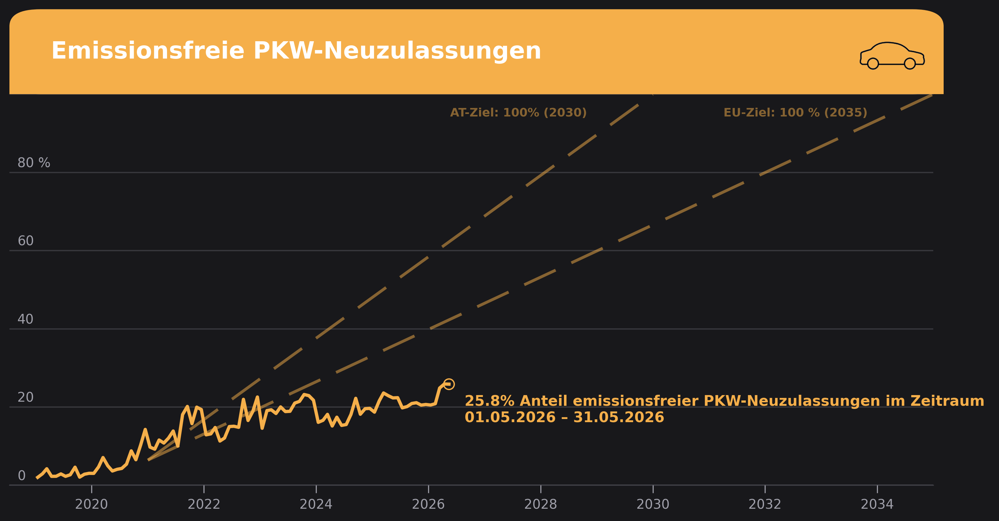

# ev_analysis

A reproducible Python pipeline for tracking the share of emission-free vehicles among new car registrations in Austria — visualized in a [Klimadashboard](https://klimadashboard.at)-inspired style.

---

## What this project does

- **Downloads** the latest new-registration data (.ods) automatically from [Statistik Austria](https://www.statistik.at/statistiken/tourismus-und-verkehr/fahrzeuge/kfz-neuzulassungen)
- **Processes** raw files into clean monthly CSVs (by fuel type: electric, hybrid, fossil, etc.)
- **Combines** all processed files into a single validated master CSV
- **Validates** the final dataset with 11 automated checks before graph creation
- **Visualizes** the emission-free vehicle share over time as a Klimadashboard-style chart



---

## Data source

**Statistik Austria** — KFZ-Neuzulassungen nach Bundesland und Kraftstoffart/Energiequelle  
https://www.statistik.at/statistiken/tourismus-und-verkehr/fahrzeuge/kfz-neuzulassungen

Data covers Austrian new **passenger car (PKW)** registrations, broken down by fuel type and federal state (*Bundesland*), from 2019 onward.

---

## Methodological notes

All data points are monthly observations. Data is plotted at the approximate mid-month date.

**Emission-free definition:** "Elektro" + "Wasserstoff/Brennstoffzelle" (hydrogen). Hydrogen is tracked separately but included in the emission-free total.  
**EV (Elektro only):** tracked as a separate column.  
**Hybrid:** "Benzin/Elektro (hybrid)" + "Diesel/Elektro (hybrid)" — not included in the graph (only in the table).  
**Policy target line:** Straight-line path from the 2021 emission-free share to 100% by 2030-12-31 (source: Österreichischer Mobilitätsmasterplan 2030).

---

## Project structure

```
kfz_dashboard_at/
├── data/
│   ├── raw/            # Downloaded .ods / .xlsx files from Statistik Austria
│   ├── processed/      # Per-month cleaned CSVs (gitignored)
│   ├── final/          # Master CSV (gitignored)
│   └── media/          # Car icon used in the chart
├── notebooks/
│   └── plot_klimadashboard_v.2.0.ipynb   # Visualization notebook (exploratory)
├── src/
│   ├── 00_process_historical_data.py     # One-time: process historical xlsx → standard format
│   ├── 01_download_data.py               # Auto-download latest .ods from Statistik Austria
│   ├── 02_process_raw_data.py            # Process all month sheets → per-month CSVs
│   ├── 03_combine_data.py                # Combine all processed CSVs → final master CSV
│   ├── 04_validate_processed_data.py     # Validate final CSV + manual confirmation prompt
│   └── 05_plot_graph.py                  # Standalone Klimadashboard-style chart script
├── outputs/                              # Exported chart images (PNG)
├── main.py                               # Run full pipeline (steps 01–05) in one command
├── requirements.txt
└── Roadmap.md
```

---

## Final CSV schema

Master file: `data/final/ev_registrations_monthly_clean.csv`  
Coverage: **2019-01 to 2026-05** (89 months, fully monthly)

| Column | Description |
|---|---|
| `month` | YYYY-MM |
| `total_new_registrations` | All new PKW registrations (Austria total) |
| `electric_new_registrations` | "Elektro" only |
| `hybrid_new_registrations` | Benzin/Elektro + Diesel/Elektro (hybrid) |
| `emission_free_registrations` | Elektro + Wasserstoff (emission-free total) |
| `ev_share` | `electric / total` (0–1) |
| `hybrid_share` | `hybrid / total` (0–1) |
| `emission_free_share` | `emission_free / total` (0–1) |
| `source_file` | Originating processed file |

---

## Setup

```bash
git clone https://github.com/peerboku/kfz_dashboard_at.git
cd kfz_dashboard_at
python -m venv .venv
source .venv/bin/activate
pip install -r requirements.txt
```

---

## Running the pipeline

**First time only** — process the historical 2019–2025 dataset:
```bash
python src/00_process_historical_data.py
```

**Monthly update — run the full pipeline in one command:**
```bash
python main.py
```

This runs steps 01–05 in sequence: download → process → combine → validate → plot. It stops if any step fails. Step 04 includes an interactive confirmation prompt before plotting.

**Or run steps individually:**
```bash
python src/01_download_data.py        # Download latest .ods from Statistik Austria
python src/02_process_raw_data.py     # Process month sheets → per-month CSVs
python src/03_combine_data.py         # Combine → final master CSV
python src/04_validate_processed_data.py  # Validate + confirmation prompt
python src/05_plot_graph.py           # Generate chart
```

---

## Chart style

The chart uses a Klimadashboard-inspired dark theme:

| Role | Color |
|---|---|
| Background | `#18181B` |
| Panel | `#27272A` |
| Grid / muted text | `#71717B` / `#9F9FA9` |
| EV line (mobility orange) | `#F5AF4A` |
| Text | `#F4F4F5` |
| Font | Barlow |

---

## Status

| Component | Status |
|---|---|
| Historical data processing (one-time) | ✅ Working |
| Download script | ✅ Working |
| Raw data processing | ✅ Working |
| Data combination | ✅ Working |
| Data validation + confirmation prompt | ✅ Working |
| Data coverage (2019-01 – 2026-05) | ✅ Complete |
| Klimadashboard-style plot (notebook) | ✅ Working |
| Chart PNG export | ✅ `outputs/klimadashboard_v.2.1.png` |
| Standalone plot script | ✅ `src/05_plot_graph.py` |
| Run-all pipeline script (`main.py`) | ✅ Working |
| Monthly automation | ⬜ Planned |
| Bundesländer analysis | ⬜ Planned |

See [Roadmap.md](Roadmap.md) for the full task list.

---

## License

[MIT](LICENSE)

---

## Author

Peer Szczepaniak — student, Universität für Bodenkultur Wien (BOKU)
