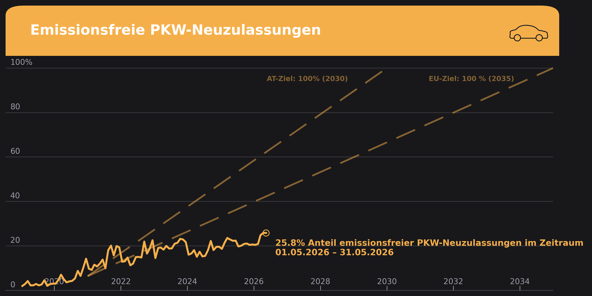

# ev_analysis

A reproducible Python pipeline for tracking the share of emission-free vehicles among new car registrations in Austria — visualized in a [Klimadashboard](https://klimadashboard.at)-inspired style.

---

## What this project does

- **Downloads** the latest new-registration data (.ods) automatically from [Statistik Austria](https://www.statistik.at/statistiken/tourismus-und-verkehr/fahrzeuge/kfz-neuzulassungen)
- **Processes** raw files into clean monthly CSVs (by fuel type: electric, hybrid, fossil, etc.)
- **Combines** annual and monthly datasets into a single master CSV
- **Visualizes** the emission-free vehicle share over time as a Klimadashboard-style chart



---

## Data source

**Statistik Austria** — KFZ-Neuzulassungen nach Bundesland und Kraftstoffart/Energiequelle  
https://www.statistik.at/statistiken/tourismus-und-verkehr/fahrzeuge/kfz-neuzulassungen

Data covers Austrian new **passenger car (PKW)** registrations, broken down by fuel type and federal state (*Bundesland*), from 2019 onward.

---

## Methodological notes

All data points are monthly observations. Data is plotted at the approximate mid-month date.

**Emission-free definition:** "Elektro" + "Wasserstoff/Brennstoffzelle" (hydrogen). Hydrogen is tracked separately but included in the emission-free total.  
**EV (Elektro only):** tracked as a separate column.  
**Hybrid:** "Benzin/Elektro (hybrid)" + "Diesel/Elektro (hybrid)" — not included in the emission-free total.  
**Policy target line:** Straight-line path from the 2021 emission-free share to 100% by 2030-12-31 (source: Österreichischer Mobilitätsmasterplan 2030).

---

## Project structure

```
ev_analysis/
├── data/
│   ├── raw/            # Downloaded .ods / .xlsx files from Statistik Austria
│   ├── processed/      # Per-year cleaned CSVs
│   ├── final/          # Master CSV (ev_registrations_monthly_clean_v.2.0.csv)
│   └── media/          # Car icon used in the chart
├── notebooks/
│   ├── plot_klimadashboard_v.2.0.ipynb   # Main visualization notebook
│   ├── process_data.ipynb                # Data processing exploration
│   ├── process_historical_data.ipynb     # Historical data reconstruction
│   └── combine_processed_files.ipynb     # Combining processed files
├── src/
│   ├── inspect_raw_data.py               # Inspect raw .ods / .xlsx structure
│   ├── 01_download_data.py               # Auto-download from Statistik Austria
│   ├── 02_process_raw_data.py            # Clean raw → processed CSV
│   ├── 03_combine_data.py                # Combine → final CSV
│   ├── 04_validate_processed_data.py     # Data validation
│   └── process_historical_data2.py       # One-time historical normalization
├── Sources/                              # Reference documents (policy targets etc.)
├── outputs/                              # Exported chart images (PNG)
├── requirements.txt
└── Roadmap.md                            # Project status and open tasks
```

---

## Final CSV schema

Master file: `data/final/ev_registrations_monthly_clean_v.2.0.csv`  
Coverage: **2019-01 to 2026-03** (86 months, fully monthly)

| Column | Description |
|---|---|
| `month` | YYYY-MM |
| `total_new_registrations` | All new PKW registrations (Austria total) |
| `electric_new_registrations` | "Elektro" only |
| `hybrid_new_registrations` | Benzin/Elektro + Diesel/Elektro (hybrid) |
| `emission_free_registrations` | Elektro + Wasserstoff (emission-free total) |
| `ev_share` | `electric / total` (0–1) |
| `hybrid_share` | `hybrid / total` (0–1) |
| `emission_free_share` | `emission_free / total` (0–1) |
| `source_file` | Originating processed file |

---

## Setup

```bash
git clone https://github.com/peerboku/ev_analysis.git
cd ev_analysis
python -m venv .venv
source .venv/bin/activate
pip install -r requirements.txt
```

---

## Running the pipeline

```bash
# 1. Download the latest raw data from Statistik Austria
python src/01_download_data.py

# 2. Process raw .ods file → cleaned CSV
python src/02_process_raw_data.py

# 3. Combine processed files → final master CSV
python src/03_combine_data.py

# 4. Validate final CSV
python src/04_validate_processed_data.py
```

The visualization is in `notebooks/plot_klimadashboard_v.2.0.ipynb`. Open with JupyterLab:

```bash
jupyter lab
```

---

## Chart style

The chart uses a Klimadashboard-inspired dark theme:

| Role | Color |
|---|---|
| Background | `#18181B` |
| Panel | `#27272A` |
| Grid / muted text | `#71717B` / `#9F9FA9` |
| EV line (mobility orange) | `#F5AF4A` |
| Text | `#F4F4F5` |
| Font | Barlow |

---

## Status

| Component | Status |
|---|---|
| Download script | ✅ Working |
| Raw data processing | ✅ Working |
| Data combination | ✅ Working |
| Data coverage (2019-01 – 2026-03) | ✅ Complete |
| Klimadashboard-style plot (notebook) | ✅ Working |
| Chart PNG export | ✅ `outputs/klimadashboard_v.2.1.png` |
| Validation script | 🟡 Needs schema update (8-column) |
| Standalone plot script | 🔴 Not extracted from notebook yet |
| Chart spec documentation | 🔴 Not written |
| Run-all pipeline script | ⬜ Planned |
| Monthly automation | ⬜ Planned |
| Bundesländer analysis | ⬜ Planned |

See [Roadmap.md](Roadmap.md) for the full task list and open decisions.

---

## License

[MIT](LICENSE)

---

## Author

Peer Szczepaniak — student, Universität für Bodenkultur Wien (BOKU)
